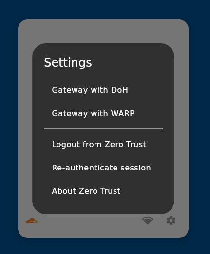

# Cloudflare WARP Panel

> **Aviso:** Este projeto está em fase beta. Podem ocorrer bugs, erros e funcionalidades incompletas.

Um painel gráfico (GUI) para gerenciar o cliente Cloudflare WARP em sistemas Linux. Oferece uma interface simples e limpa para controlar o estado da conexão do WARP.

---

## Funcionalidades

- Conectar e desconectar do serviço Cloudflare WARP com um clique.
- Visualizar o estado atual da conexão.
- Interface minimalista, integrada ao ambiente de desktop.

---

## Capturas de Tela

### Tela inicial (Conectado)  


### Tela inicial (Desconectada)  


### Tela de opções / configurações  


---

## Tecnologias Utilizadas

- **Flutter:** Framework para construir aplicações nativas multiplataforma.
- **bitsdojo_window:** Para personalização da janela, removendo a moldura padrão do sistema.
- **flutter_svg:** Para renderizar ícones e logotipos no formato SVG.

---

## Instalação e Execução no Linux

### Pré-requisitos

- Flutter SDK instalado.
- Cliente Cloudflare WARP instalado no sistema Linux.

### Executando em modo desenvolvimento

No terminal, dentro da pasta do projeto, execute:

```bash
flutter run -d linux
```

### Construindo a versão de lançamento

Para gerar uma versão otimizada para distribuição:

```bash
flutter build linux
```

O executável será gerado em:

```
build/linux/x64/release/bundle
```

---

## Contribuição

Se você é desenvolvedor Flutter e deseja colaborar com o projeto, sinta-se à vontade para:

- **Abrir uma Issue:** Para reportar bugs, comportamentos inesperados ou sugerir funcionalidades.
- **Abrir um Pull Request:** Para contribuir diretamente com código.

Agradecemos sua ajuda para melhorar este projeto!

---

## Licença

*(adicione aqui informações sobre a licença do projeto, se houver)*
