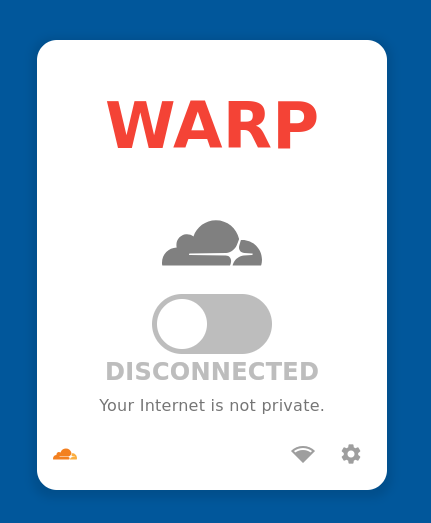

Cloudflare WARP Panel

    Aviso: Este projeto está em fase beta. Podem haver bugs, erros e funcionalidades incompletas.

Um painel gráfico (GUI) para controlar o cliente da Cloudflare WARP em sistemas operacionais Linux. Este projeto fornece uma interface de usuário simples e limpa para gerenciar o estado de conexão do WARP.
Funcionalidades

    Conectar e desconectar do serviço Cloudflare WARP com um clique.

    Visualizar o estado de conexão atual.

    Interface minimalista e integrada com o ambiente de desktop.

Screenshots

Aqui estão algumas capturas de tela do aplicativo em ação:
Tela inicial (Conectado)
Tela inicial (Desconectado)

Tela de opções
Tecnologias

O projeto é construído usando o framework Flutter e foi projetado para a plataforma desktop Linux.

    Flutter: Framework de UI para construir aplicações nativas e multiplataforma.

    bitsdojo_window: Utilizado para personalizar a janela do aplicativo, removendo a moldura padrão do sistema.

    flutter_svg: Usado para renderizar os ícones e logotipos em formato SVG.

Instalação e Execução (Linux)
Pré-requisitos

    Flutter SDK instalado.

    Cloudflare WARP client instalado no seu sistema Linux.

Executando em modo de desenvolvimento

Para executar o aplicativo no seu desktop Linux em modo de depuração (debug), use o seguinte comando no terminal do projeto:

flutter run -d linux

Construindo a versão de lançamento

Para compilar uma versão otimizada do aplicativo para distribuição, use o comando:

flutter build linux

O binário executável será gerado no diretório build/linux/x64/release/bundle.
Contribuição

Se você é um desenvolvedor Flutter e gostaria de ajudar a melhorar este projeto, a sua contribuição é muito valiosa. Sinta-se à vontade para:

    Abrir uma Issue: Se encontrar algum bug, comportamento inesperado ou tiver uma sugestão de nova funcionalidade.

    Abrir um Pull Request: Contribua diretamente com o código.

Agradecemos a sua ajuda para tornar este projeto melhor!
