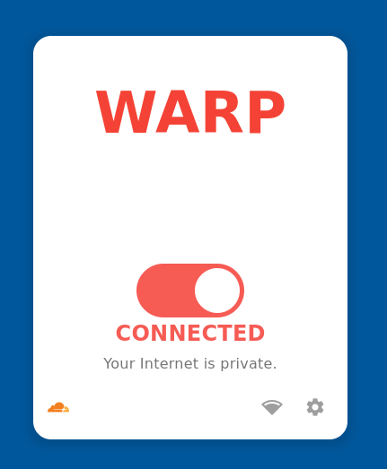

# 🚀 Cloudflare WARP Panel

<div align="center">

[](https://flutter.dev)
[](https://www.linux.org/)
[](https://www.cloudflare.com/)

**A modern graphical panel to manage the Cloudflare WARP client on Linux systems**

*Simple, elegant interface integrated with your desktop environment*

</div>

---

## ⚠️ Project Status

> **🧪 Beta Version:** This project is under active development. Bugs, errors, and incomplete features may occur. Your contributions and feedback are very welcome!

---

## ✨ Features

<table>
<tr>
<td>

### 🔌 **Simple Control**
Connect and disconnect from Cloudflare WARP service with just one click

</td>
<td>

### 📊 **Real-time Status**
View your connection status clearly and intuitively

</td>
</tr>
<tr>
<td>

### 🎨 **Minimalist Interface**
Clean and modern design that integrates perfectly with your desktop

</td>
<td>

### ⚙️ **Advanced Settings**
Access options and configurations through a user-friendly interface

</td>
</tr>
</table>

---

## 📸 Screenshots

<div align="center">

### 🟢 Connected State


### 🔴 Disconnected State


### ⚙️ Settings Panel


</div>

---

## 🛠️ Technologies

<div align="center">

| Technology | Description | Version |
|:----------:|-------------|:------:|
| **Flutter** | Cross-platform framework for native interfaces |  |
| **bitsdojo_window** | Advanced desktop window customization |  |
| **flutter_svg** | SVG icons and logos rendering |  |

</div>

---

## 🚀 Installation and Usage

### 📋 Prerequisites

Before starting, make sure you have:

- ✅ **Flutter SDK** installed and configured
- ✅ **Cloudflare WARP client** installed on Linux system
- ✅ **Linux dependencies** for Flutter development

### 🔧 Development Mode

Run the project in development mode:

```bash
# Clone the repository
git clone https://github.com/johnpetersa19/cloudflare_warp_panel.git
cd cloudflare_warp_panel

# Install dependencies
flutter pub get

# Run in development mode
flutter run -d linux
```

### 📦 Production Build

To generate an optimized version for distribution:

```bash
# Generate release build
flutter build linux --release

# The executable will be available at:
# build/linux/x64/release/bundle/
```

### 🎯 Quick Installation

```bash
# Make the executable file executable
chmod +x build/linux/x64/release/bundle/cloudflare_warp_panel

# Run the application
./build/linux/x64/release/bundle/cloudflare_warp_panel
```

---

## 🤝 Contributing

<div align="center">

**We love contributions! Here's how you can help:**

</div>

### 🐛 Report Bugs
Found a problem? [Open an Issue](https://github.com/johnpetersa19/cloudflare_warp_panel/issues/new) describing:
- Expected vs actual behavior
- Steps to reproduce
- Screenshots if applicable
- System information

### 💡 Suggest Features
Have an amazing idea? [Create an Issue](https://github.com/johnpetersa19/cloudflare_warp_panel/issues/new) with:
- Detailed feature description
- Use cases
- Mockups or examples (optional)

### 🔧 Contribute Code
1. **Fork** this repository
2. **Create** a branch for your feature (`git checkout -b feature/awesome-feature`)
3. **Commit** your changes (`git commit -m 'Add awesome feature'`)
4. **Push** to the branch (`git push origin feature/awesome-feature`)
5. **Open** a Pull Request

---

## 📊 Roadmap

- [ ] 🌐 Multi-language support
- [ ] 🔔 System notifications
- [ ] 📈 Usage statistics
- [ ] 🎨 Customizable themes
- [ ] 🚀 Auto-updater
- [ ] 📱 Support for other operating systems

---

## 📄 License

This project is licensed under the MIT License. See the [[LICENSE](https://github.com/johnpetersa19/cloudflare_warp_panel/blob/main/LICENSE.txt)] file for more details.

---

<div align="center">

**⭐ If this project was helpful to you, consider giving it a star!**

[](https://github.com/johnpetersa19/cloudflare_warp_panel/stargazers)
[](https://github.com/johnpetersa19/cloudflare_warp_panel/network)

**Made with ❤️ for the Linux community**

</div>
