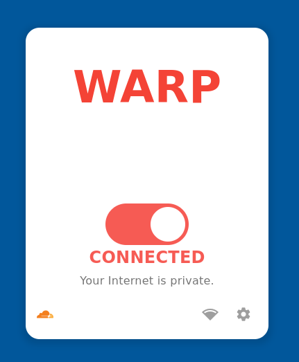

<div align="center">
  <a href="README.md">
    
  </a>
  <a href="README_PT.md">
    
  </a>
</div>

---

<br>

<a name="pt"></a>
# 🚀 Cloudflare WARP Panel

**Procurando por colaboradores para melhorar o projeto!**

<div align="center">

[](https://flutter.dev)
[](https://www.linux.org/)
[](https://www.cloudflare.com/)

**Um painel gráfico moderno para gerenciar o cliente Cloudflare WARP em sistemas Linux**

*Interface simples e elegante, integrada ao ambiente de desktop*

</div>

---

## ⚠️ Status do Projeto

> **🧪 Versão Beta:** Este projeto está em desenvolvimento ativo. Erros, bugs e recursos incompletos podem ocorrer. Suas contribuições e feedback são muito bem-vindos!

---

## ✨ Recursos Atuais

### ✅ **Implementado**

<table>
<tr>
<td>

### 🔌 **Controle de Conexão**
- Conectar/desconectar o WARP com um clique
- Exibição do status de conexão em tempo real
- Indicadores visuais de status (CONECTADO/DESCONECTADO)

</td>
<td>

### ⚙️ **Configurações Básicas**
- Troca de modo (DoH/WARP/WARP+DoH/DoT/WARP+DoT/Proxy/Tunnel Only)
- Logout e reautenticação de sessão
- Reautenticação de acesso de depuração

</td>
</tr>
<tr>
<td>

### 📋 **Gerenciamento de Registro**
- Visualizar informações de registro atuais
- Excluir registro existente
- Registrar novo cliente WARP

</td>
<td>

### ℹ️ **Painel de Informações**
- Janela "Sobre Cloudflare" com informações da versão
- Links para política de privacidade e termos de serviço
- Informações sobre licenças de terceiros

</td>
</tr>
<tr>
<td>

### 🌐 **Configurações de DNS**
- Configuração de fallback de DNS
- Alternância de log de DNS
- Exibir estatísticas de DNS e fallbacks padrão

</td>
<td>

### 🔗 **Configuração de Proxy**
- Configurações de porta de proxy personalizadas

</td>
</tr>
<tr>
<td>

### 🎯 **Gerenciamento de Alvos**
- Listar todos os alvos disponíveis

</td>
<td>

### 🛡️ **Redes Confiáveis**
- Configurações de confiança de Ethernet
- Configurações de confiança de Wi-Fi
- Gerenciamento de lista de SSIDs confiáveis (adicionar/remover/listar/redefinir)

</td>
</tr>
<tr>
<td>

### 📊 **Estatísticas e Monitoramento**
- Exibição de estatísticas de uso em tempo real
- Contadores de dados para tráfego WARP e não-WARP
- Rastreamento de pico de velocidade

</td>
<td>

### 🔧 **Ferramentas de Depuração**
- Interface de depuração de rede
- Ferramentas de verificação de postura
- Exibição de dados DEX
- Alternar verificação de conectividade

</td>
</tr>
<tr>
<td>

### 🚇 **Configurações de Túnel**
- Estatísticas de túnel
- Rotação de chaves

</td>
<td>

### 🔌 **Recursos Avançados**
- Gerenciamento de ambiente (definir/redefinir)
- Gerenciamento de rede virtual (VNet)
- Recuperação de configurações de MDM
- Overrides de política (exibir/desbloquear/acesso à rede local)
- Exibir certificados da conta

</td>
</tr>
</table>

### 🚧 **Em Desenvolvimento**

> Os itens da seção "Em Desenvolvimento" foram movidos para a seção "Implementados" porque já foram codificados no projeto.

---

## 📸 Capturas de Tela

<div align="center">

### 🟢 Estado Conectado


### 🔴 Estado Desconectado


### ⚙️ Painel de Configurações


</div>

---

## 🛠️ Tecnologias

<div align="center">

| Tecnologia | Descrição | Versão |
|:----------:|-------------|:------:|
| **Flutter** | Framework multiplataforma para interfaces nativas |  |
| **bitsdojo_window** | Personalização avançada da janela de desktop |  |
| **flutter_svg** | Renderização de ícones e logotipos SVG |  |
| **shared_preferences** | Armazenamento local de dados para preferências do usuário |  |
| **path_provider** | Provedor de caminho do sistema de arquivos multiplataforma |  |
| **url_launcher** | Inicializador de URL interno e externo |  |

</div>

---

## 🚀 Instalação e Uso

### 📋 Pré-requisitos

Antes de começar, certifique-se de ter:

- ✅ **Flutter SDK** instalado e configurado
- ✅ **Cliente Cloudflare WARP** (`warp-cli`) instalado no sistema Linux
- ✅ **Dependências Linux** para desenvolvimento Flutter

### 🔧 Modo de Desenvolvimento

Execute o projeto no modo de desenvolvimento:

```bash
# Clone o repositório
git clone https://github.com/johnpetersa19/cloudflare_warp_panel.git
cd cloudflare_warp_panel

# Instale as dependências
flutter pub get

# Execute no modo de desenvolvimento
flutter run -d linux
```

### 📦 Construção para Produção

Para gerar uma versão otimizada para distribuição:

```bash
# Gere a versão de lançamento
flutter build linux --release

# O executável estará disponível em:
# build/linux/x64/release/bundle/
```

### 🎯 Instalação Rápida

```bash
# Torne o arquivo executável executável
chmod +x build/linux/x64/release/bundle/cloudflare_warp_panel

# Execute a aplicação
./build/linux/x64/release/bundle/cloudflare_warp_panel
```

---

## 🗂️ Arquitetura

O aplicativo é construído com uma arquitetura modular:

- **Painel de Controle Principal**: Central para gerenciamento de conexão
- **Diálogos de Configuração**: Janelas de configuração organizadas
- **Executor de Comandos**: Interface genérica para o comando `warp-cli`
- **Gerenciador de Status**: Monitoramento do estado da conexão em tempo real
- **Persistência de Dados**: Usa `shared_preferences` para armazenamento local de preferências e estatísticas do usuário.
- **Monitoramento de Velocidade**: Usa `dart:io` `Process` para ler estatísticas de rede de `/sys/class/net` e fornece exibição animada em tempo real.

Toda a funcionalidade é baseada na função `_executeWarpCommand`, que fornece uma maneira padronizada de interagir com o CLI do Cloudflare WARP.

---

## 🤝 Contribuição

<div align="center">

**Adoramos contribuições! Veja como você pode ajudar:**

</div>

### 🐛 Relatar Bugs
Encontrou um problema? [Abra uma Issue](https://github.com/johnpetersa19/cloudflare_warp_panel/issues/new) descrevendo:
- Comportamento esperado vs. real
- Passos para reproduzir
- Capturas de tela, se aplicável
- Informações do sistema

### 💡 Sugerir Recursos
Tem uma ideia incrível? [Crie uma Issue](https://github.com/johnpetersa19/cloudflare_warp_panel/issues/new) com:
- Descrição detalhada do recurso
- Casos de uso
- Mockups ou exemplos (opcional)

### 🔧 Contribuir com Código

1. **Fork** este repositório
2. **Crie** um branch para o seu recurso (`git checkout -b feature/recurso-incrivel`)
3. **Commit** suas alterações (`git commit -m 'Adicionar recurso incrível'`)
4. **Push** para o branch (`git push origin feature/recurso-incrivel`)
5. **Abra** um Pull Request

---

## 📊 Roteiro de Desenvolvimento

### 🎯 **Fase 1 - Recursos Essenciais** (Concluído)

- [x] Controle básico de conexão
- [x] Gerenciamento de registro
- [x] Base para as configurações
- [x] Interface de configuração de DNS
- [x] Painel de configurações de proxy

### 🎯 **Fase 2 - Gerenciamento Avançado** (Concluído)

- [x] Estatísticas e monitoramento
- [x] Configuração de redes confiáveis
- [x] Interface de ferramentas de depuração
- [x] Gerenciamento de túnel

### 🎯 **Fase 3 - Recursos Profissionais** (Concluído)

- [x] Suporte para conector
- [x] Conformidade com o ambiente
- [x] Gerenciamento de rede virtual (VNet)
- [x] Depuração avançada

### 🎯 **Fase 4 - Aprimoramento** (Planejado)

- [ ] 🌍 Suporte a vários idiomas
- [ ] 🔔 Notificações do sistema
- [ ] 🎨 Temas personalizáveis
- [ ] 🚀 Auto-atualizador

---

## 📄 Licença

Este projeto é licenciado sob a Licença MIT. Consulte o arquivo [LICENSE](https://github.com/johnpetersa19/cloudflare_warp_panel/blob/main/LICENSE.txt) para mais detalhes.

---

<div align="center">

**⭐ Se este projeto foi útil para você, considere dar uma estrela!**

[](https://github.com/johnpetersa19/cloudflare_warp_panel/stargazers)
[](https://github.com/johnpetersa19/cloudflare_warp_panel/network)

**Feito com ❤️ para a comunidade Linux**

</div>
